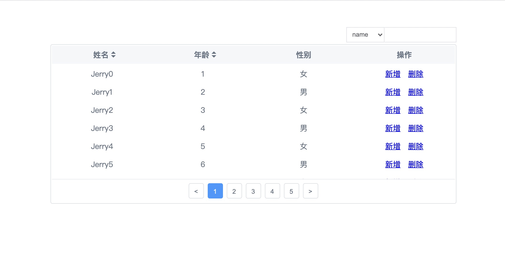
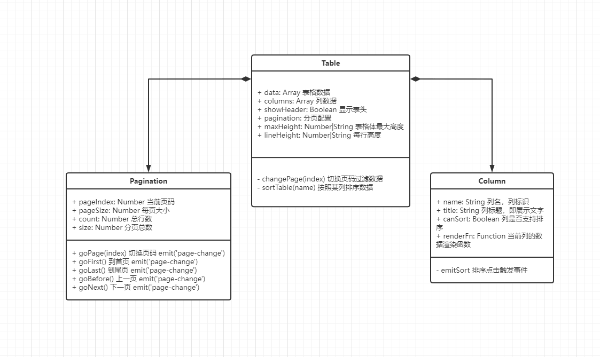
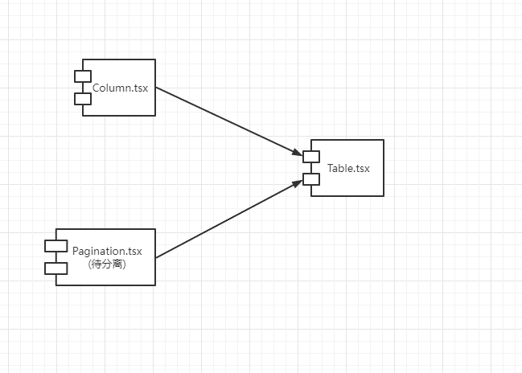
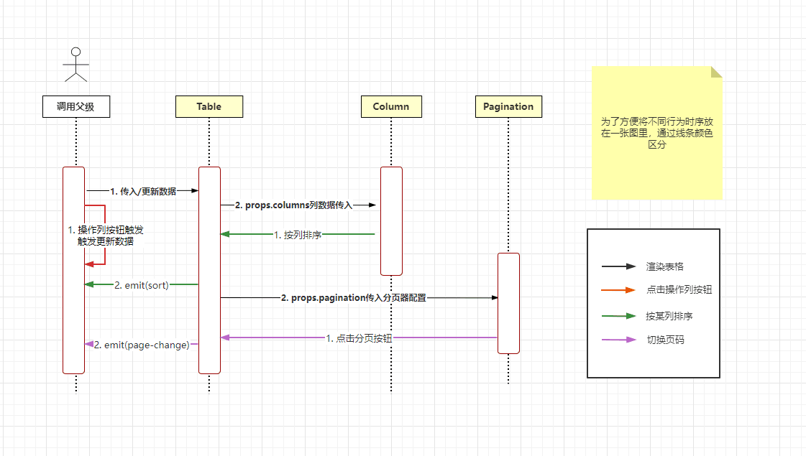

# TestTable简易表格组件



## UML图

### 类图



### 组件图



### 时序图



### 需求点
- [x] 支持表头、表格内容、分页功能
    - [x] 表头支持slot自定义渲染
    - [x] 表格内容支持`renderFn`自定义渲染
    - [x] 支持渲染页码按钮进行分页
    - [x] 上一页下一页
    - [ ] ~~跳转到指定页码~~
- [x] 支持本地静态数据加载
- [ ] ~~支持远程数据加载~~
- [x] 支持排序功能
    - [x] 升序/降序
    - [x] 列排序后有高亮小三角标明
- [x] 支持筛选功能
    - [x] 支持配置筛选字段
    - [x] 支持对renderFn自定义渲染函数过滤过的内容进行筛选


### DEMO

```vue
<template>
  <div class="table_demo">
    <TestTable
      :data="tableData"
      :columns="tableColumns"
      :pagination="tablePagination"
      :filters="tableFilters"
      :max-height="240"
    >
      <template #operator="{ item }">
        <a class="mr-1"
           href="javascript:void(0)"
           @click="addItem">新增</a>
        <a href="javascript:void(0)"
           @click="deleteItem(item)">删除</a>
      </template>
    </TestTable>
  </div>
</template>
<script lang="ts">
import { TestTable } from '../src/table'
import { defineComponent, ref } from '@vue/composition-api'

export default defineComponent({
  name: 'App',
  components: {
    TestTable,
  },
  setup() {
    const tableData = ref([
      {
        name: 'Tom',
        age: 10,
        sex: 1
      },
      {
        name: 'Jerry',
        age: 11,
        sex: 1
      },
      {
        name: 'Mike',
        age: 23,
        sex: 0
      },
      {
        name: 'Lura',
        age: 41,
        sex: 0
      },
      {
        name: 'Max',
        age: 100,
        sex: 1
      },
    ])
    const tableColumns = ref([
      {
        name: 'name',
        title: '姓名',
        canSort: true,
      },
      {
        name: 'age',
        title: '年龄',
        canSort: true,
      },
      {
        name: 'sex',
        title: '性别',
        renderFn: (val: Sex): SexStr => {
          return val ? '男' : '女'
        },
      },
    ])
    const tableFilters = ref(['name', 'age', 'sex'])
    const tablePagination = ref({
      pageSize: 10, // 每页大小
      pageIndex: 1, // 当前页码
    })
    const deleteItem = (item: Staff) => {
      const deleteIndex = tableData.value.findIndex(data => data.name === item.name)
      tableData.value.splice(deleteIndex, 1)
    }
    const addItem = () => {
      tableData.value.push({
         name: 'diy',
         age: 18,
         sex: 1
      })
    }

    return { 
        tableData, 
        tableColumns, 
        tableFilters, 
        tablePagination, 
        deleteItem, 
        addItem 
    }
  },
})
</script>
```


## Table代码API解释

### props


| 参数 | 描述 | 类型 | 默认值 |
| --- | :---- | ----| ----|
| `data` | 表格静态数据 | `Array` | `[]` |
| `columns` | 列头数据 | `Array<ColumnsProps>` | `[]` |
| `showHeader` | 是否展示表头 | `Boolean` | `true` |
| `pagination` | 分页配置 | `PropType<paginationType> | false` | `false` |
| `maxHeight` | 表格体最大高度，超出滚动显示 | `Number | String` | `-1` |
| `filters` | 筛选器配置 | `String[]` | [] |

### slots

| 名称 | 描述 | 参数 |
| --- | :---- | ----|
| `operator` | 操作列插槽 | `item`当前行数据 |
| `column.name` | 列配置的name，可通过slot重新render列头 | `column` 返回当前列配置 |

### 一些自定义类型的说明

#### **`ColumnsProps`**

| 参数 | 描述 | 类型 | 默认值 |
| --- | --- | --- | --- |
| `name` | 列名作为PK被使用将默认生成对应列名的`slot.name` | String | '' |
| `title` | 列标题 | String | '' |
| `canSort` | 当前列能否排序 | Boolean | false |
| `renderFn` | 当前列数据的自定义渲染函数 | Function | undefined | undefined |
| `sortState` | 当前表格排序信息 | TSortState | { name: '', direction: 0 } |

#### **`paginationType`**
| 参数 | 描述 | 类型 | 默认值 |
| --- | --- | --- | --- |
| `pageIndex` | 默认页码 | Number | 1 |
| `pageSize` | 每页大小 | Number | 10 |

#### **`TSortState`**
| 参数 | 描述 | 类型 | 默认值 |
| --- | --- | --- | --- |
| `name` | 排序列的name | String | 1 |
| `direction` | 排序方式，升降序 | `0（降序）` ｜ `1（升序）` | 0 |