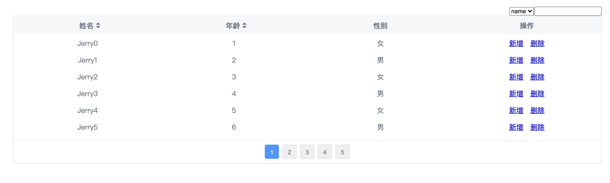

# TestTable简易表格组件

## UML图

### 类图

### 组件图

### 时序图

## Table代码API解释

### 需求点
- [x] 支持表头、表格内容、分页功能
    - [x] 表头支持slot自定义渲染
    - [x] 表格内容支持`renderFn`自定义渲染
    - [x] 支持渲染页码按钮进行分页
    - [ ] ~~上一页下一页~~
    - [ ] ~~跳转到指定页码~~
- [x] 支持本地静态数据加载
- [ ] ~~支持远程数据加载~~
- [x] 支持排序功能
    - [x] 升序/降序
    - [x] 列排序后有高亮小三角标明
- [x] 支持筛选功能
    - [x] 支持配置筛选字段
    - [x] 支持对renderFn自定义渲染函数过滤过的内容进行筛选

### props

| 名称 | 描述 | 类型 | 默认值 |
| --- | :---- | ----| ----|
| `data` | 表格静态数据 | `Array` | `[]` |
| `columns` | 列头数据 | `Array<PropType<ColumnPublicProps>>` | `[]` |
| `showHeader` | 是否展示表头 | `Boolean` | `true` |
| `pagination` | 分页配置 | `PropType<paginationType> | false` | `false` |
| `maxHeight` | 表格体最大高度，超出滚动显示 | `Number | String` | `-1` |
| `filters` | 筛选器配置 | `String[]` | [] |

### slots

| 名称 | 描述 | 参数 |
| --- | :---- | ----|
| `operator` | 操作列插槽 | `item`当前行数据 |
| `column.name` | 列配置的name，可通过slot重新render列头 | `column` 返回当前列配置 |

### events

| 名称 | 描述 | 参数 |
| --- | :---- | ----|
| `sort` | 排序 | `Object` 排序列name，升降序sort |
| `page-change` | 页码切换 | `Number` 切换后页码 |
